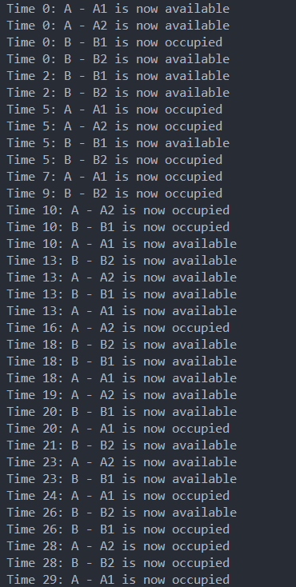

<h1 align="center">
     
  <!--  -->
   
  Smart City Parking Management System
   
</h1>

<h4 align="center">A smart city parking system offering real-time parking availability, dynamic pricing, user reservations, IoT-based monitoring, role-based access, and advanced reporting for efficient urban parking management.</h4>

<!-- 

  
  
  
  

 -->

  <a href="#key-features">Key Features</a> •
  <a href="#how-to-use">How To Use</a> •
  <a href="#dependencies">Dependencies</a> •
  <a href="#app-design">App Design</a> •
  <a href="#documentation">Documentation</a> •
  <a href="#contact">Contact</a> •
  <a href="#license">License</a> •
  <a href="#acknowledgements">Acknowledgements</a>

<!--  -->

---

## Key Features

1. **Real-Time Parking Spot Availability**: Tracks and updates spot status in real-time.  
2. **Dynamic Pricing**: Adjusts parking fees based on time, demand, and location.  
3. **User Reservations**: Allows users to search, reserve, and manage parking spots.  
4. **Role-Based Access Control**: Separate access for drivers, parking lot managers, and system administrators.  
5. **IoT Integration (Simulated)**: Simulates real-time monitoring of parking spots.  
6. **Notifications and Alerts**: Alerts for reservations, time nearing expiry, and admin issues.  
7. **Reporting and Analytics**: Dashboards and reports for parking lot performance and user activity.  
8. **Authentication and Authorization**: Secure role-based login system.  
9. **Concurrency Control**: Prevents double booking with transaction integrity.  
10. **Web-Based Interface**: User-friendly platform for searching and booking spots.  
11. **Scalability and Performance Optimization**: Handles high user loads efficiently.  
12. **Advanced Transactions**: Ensures consistency in reservations and payments.  

---

## How To Use

This project has pre-built React and Spring Boot applications that can be run independently. The React frontend communicates with the Spring Boot backend via REST APIs.

---

## Dependencies

- [React](https://reactjs.org/)
- [Spring Boot](https://spring.io/projects/spring-boot)
- [MySQL](https://www.mysql.com/)

---

## App Design

- EER Diagram
  
- Login Page
  
- Signup Page
  
- Home Page
  
  
- Admin Panel
   
- Reports
  
  
- Iot Simulation
- 
  
- User Information
  
---

## Documentation

Design Detials can be found in the [docs](docs/report.pdf) folder.

---

## Contact

1. [**Mohamed Hassan**](https://github.com/mohassan5286)
2. [**Omar Hany**](https://github.com/OmarHani4306)
3. [**Mohamed Mohamed Ibrahim**](https://github.com/Mohamed-Mohamed-Ibrahim)

---

## License

Licensed under the [MIT License](LICENSE).

---

## Acknowledgements

- This project was developed as part of the Database Systems course at the Alexandria University in Alexandria, Egypt.
- Special thanks to our professor and teaching assistant for their guidance and support.
- Course Instructor:
  - Prof: Dr. Hicham Elmongui
  - Teaching Assistant: Eng. Omar Ahmed Wasfy